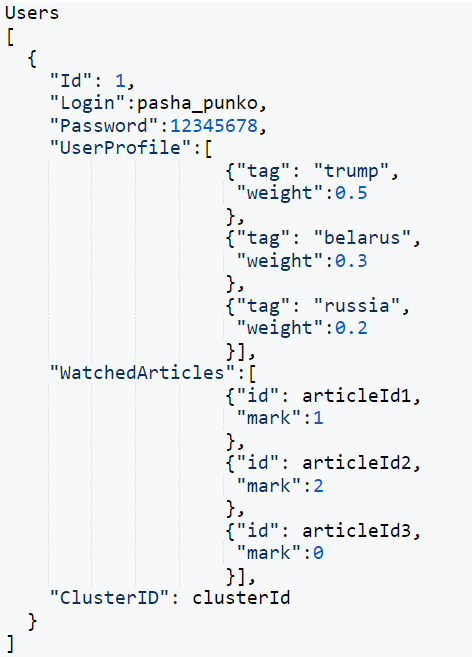
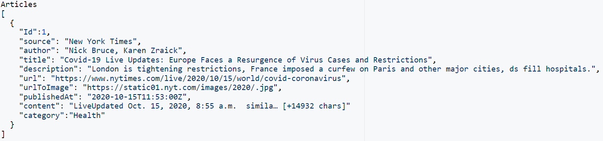
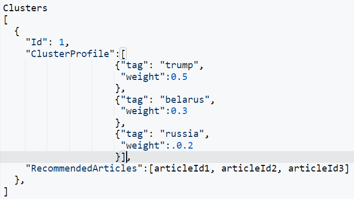
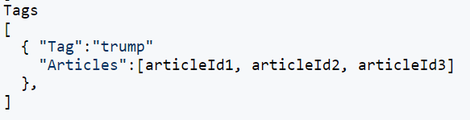
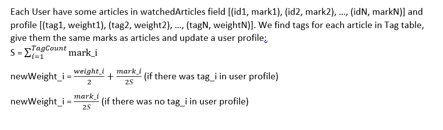
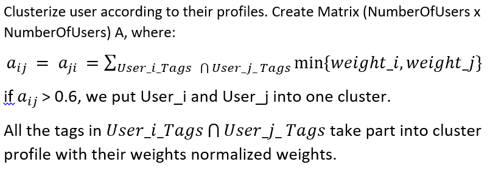

# NewsService
News service is a platform that provides last 24-hours news according to user’s preferences. Users can register at the platform, search news with keywords or just open recommendations and read the news that propose our service. 
<h3>Structure:</h3>
 <ul><li><h4>Pages</h4>
  <ul><li><h5>Homepage.</h5> Page with recommended or “hot” news and the ability to search news using keywords. It also contains user’s statistics at the right column
  <li><h5>Page with article.</h5> Articles, links to related articles and estimation ability will be placed here. Users can estimate the article if it fits them or not.
  </ul>
  <li><h4>Databases</h4>We will have at least 4  collections: User’s collection with their information for authentication and their preferences (keywords for our recommendation system), article's collection that updates every day, tag's collection and cluster's collections. 
  <ul>
   <li>
   <li>
   <li>
   <li>
    </ul>
 <li><h4>Algorithms</h4>
     Every Night our algorithm do next steps to update content:
     <ul>
      <li> 
      <li> 
      <li> Collect News: most popular news for each category and news with most popular tags for each category (to have the category field in article). Using Python library we take tags from definition for each news (only nouns).
      <li> For each cluster we will recommend 100 news: 
Find 100*weight_i News with tag_i keyword for each tag in cluster profile.
     </ul>
    Users ability: authorization and autentication; whatch popular, recommended news and news of each category; estimate articles, whatch similar articles. 
    Admin ability: the same as users, but can edit, delete articles and delete users.
 <li><h4>API</h4>
     News API is the best case for this project, because requests already contain keywords and it has a huge spectrum of usage.
  </ul>

<h3>Stack</h3>
 <ul><li><h4>Frontend:</h4>
  <ul><li>Angular
  <li>Node.js</ul>
 <li><h4>Backend:</h4>
  <ul>
  <li>Node.js
  <li>MongoDB
   </ul></ul>
 

https://travis-ci.com/alexErm0/NewsService
 
